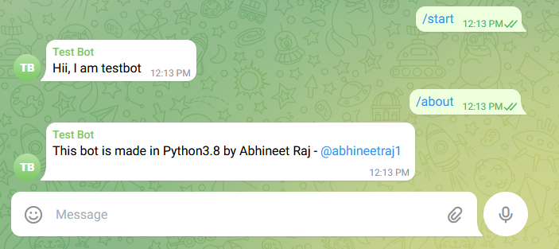

# Telegram-bot API (in Python)

*	This library provides a pure Python, asynchronous interface for the Telegram Bot API. It's compatible with Python versions 3.7+.
*	Made for Auto replies in group.
*	If you are using ServeBot function , better deploy it into linux VPS server.
## Installation
*	Install python3.8
*	Downnload this project

## Guide

### For sending messages in group

```
from telegram_bot import*
Bot.set(api) #Get your api from BotFather
Bot.sendMessage("Hello World",chat_id) #Get the chatID of the required group
```

### For sending recieving commands in group

```
from telegram_bot import*
Bot.set(api) #Get your api from BotFather
Bot.getMessages(chat_id) #Get the chat Id of the required group
```

If someone sends /hello , you will recieve "/hello" value

### Creating an auto reply server

```
from telegram_bot import*
Bot.set(api) #Get your api from BotFather

ServeBot.command(chat_id, command, reply) # Get the chat_id of the group
ServeBot.run()
```

#### Example

*	Code
```
from telegram_bot import*
Bot.set("5681058372:AAE6VWdgxWLQqKHvmY6ceJw0lEy20B-Vjjg")
ServeBot.commands("-704414602","/start","Hii, I am testbot")
ServeBot.commands("-704414602","/about","This bot is made in Python3.8 by Abhineet Raj - @abhineetraj1")
ServeBot.run()
```
*	Image

<br>

#### Note:-
The api and chat id used in example is expired.